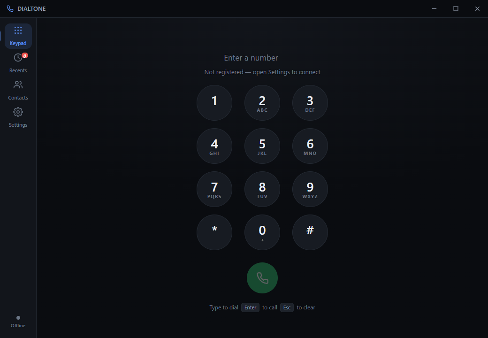

# Dialtone

A desktop softphone for FreeSWITCH. Keypad, recents, contacts, settings —
the things a phone app does, on a PC.



## Installing it

Run **`Dialtone-Setup-<version>.exe`**. Electron, the app and JsSIP are all
inside it — nothing else needs installing. Per-user, so no admin prompt.

Or from source:

```bash
npm install
npm start
```

`npm run dist` rebuilds the installer.

First launch opens Settings, because there is nothing to dial with until an
account is configured. Fill in the four fields, press **Save & connect**, and
the dot in the bottom-left corner goes green.

**Before it can connect, the server needs setting up** — a WebSocket binding,
a directory user, and a codec rule for inbound calls. That is not optional
configuration, it is the transport this app uses.

📖 **[SETUP.md](SETUP.md) is the full guide** — server and app, end to end,
with a troubleshooting table for the failures that present as something other
than what they are. Start there.

For a server that already exists, [`freeswitch/README.md`](freeswitch/README.md)
covers just the config changes; [`freeswitch/pi/`](freeswitch/pi/) has a
scripted setup that coexists with another FreeSWITCH on the same host.

## What it does

**Keypad** — type or click, hold `0` for `+`, `Enter` to call, `Esc` to
clear. Real DTMF tones on each key. If the number matches a contact, the name
appears under it before you dial.

**Recents** — grouped by day, filterable to missed only, with a badge on the
rail for missed calls you have not looked at. Selecting a call shows every
other call with that number.

**Contacts** — favourites, A–Z sections, search across name, company and
number. Avatar colours are derived from the name, so a person is the same
colour every time.

**Settings** — account, a live microphone level meter (the fastest way to
answer "is it using the right mic?"), speaker selection, separate volume
sliders for the ringtone and the keypad tones (the ringtone previews itself
when you let go of the slider), and theme.

**Behaviour** — start with Windows (straight into the tray, no window); keep
running in the tray when closed, so closing the window doesn't silently stop
you taking calls; and a call popup when someone rings.

**Call popup** — when a call arrives and Dialtone is not in front, a small
window slides in at the bottom-right: caller avatar, name, Answer and Decline.
Answering turns it into a live timer; it slides back out when either side
hangs up. Nothing is dragged to the foreground, and it never takes focus from
what you were typing into.

**Backup** — export account, contacts and history to a file and import them
on another machine. The password is excluded by default, because it is
encrypted against the original machine and cannot travel any other way than
in the clear; there is a toggle if you want that trade. Import offers merge
(contacts matched by number, so re-importing your own export is a no-op) or
replace.

**In a call** — mute, hold, and a keypad for IVR menus, over a call screen
that shows who and how long. Stepping away from it leaves a live pill in the
title bar rather than losing the call.

Incoming calls ring, and can be answered or declined.

## Changing your voice

Settings → Voice transforms the outgoing microphone. It never touches what you
hear.

The thing that makes most voice changers obvious is that they shift pitch and
drag the **formants** along with it. Formants are the resonances of your throat
and mouth, and their positions encode the size of the speaker — move them with
the pitch and you do not sound like a different person, you sound like the same
person on helium. Dialtone moves the two independently:

| control | what it changes |
|---|---|
| **Pitch** | how high the voice reads |
| **Size** | how large the speaker reads (the formants) |
| **Brightness** | spectral tilt, a finishing touch |

A convincing change is a large pitch move with a *small* size move — the
`Higher` preset is pitch ×1.62 with formants only ×1.16, which is roughly the
real difference between an adult male and female voice. Setting both to the
same number is exactly what produces a cartoon.

`Disguised` is the subtlest option: it keeps your pitch close to normal and
changes the timbre. It is the least noticeable to a stranger and the most
effective against somebody who knows your voice.

**Record and play back** captures three seconds and replays it exactly as the
far end would receive it. Use headphones, or it records its own playback.

Measured against synthetic speech with known pitch and formants
(`tools/voicelab`), on the default `Higher` preset:

- F0 moves ×1.621 against a ×1.62 request
- the spectrum moves ×1.15 against a ×1.16 request — the formants follow their
  own ratio, not the pitch
- plosive attacks stay within ×1.12, so consonants do not smear
- 42.7ms of latency, about 7% of one core

Known limits: it transforms voices, not identities — it will not make you sound
like a specific person, and it is not trying to. Turning it on or off takes
effect on the next call, because that changes the shape of the audio graph
rather than a parameter. And a signal with no jitter at all (a synthesiser, not
a human) has deep enough spectral nulls to confuse the envelope estimator.

## Keyboard

| | |
|---|---|
| `0`–`9`, `*`, `#` | dial (from anywhere on the keypad screen) |
| `Enter` | call |
| `Backspace` | delete a digit |
| `Esc` | clear, or step back from the call screen |
| `Ctrl`+`1`–`4` | switch views |

## Where things are

```
main.js            window, files on disk, the SIP password, TLS trust
preload.js         the only bridge to Node — a fixed list of verbs
preload-toast.js   a much smaller bridge, just for the call popup
src/toast.html     the incoming-call popup, its own frameless window
src/js/phone.js    all SIP: registration, one call, mute/hold/DTMF
src/js/store.js    state, and the only thing that writes it
src/js/audio.js    every sound, synthesised — no audio assets
src/js/ui/         one module per screen
src/css/tokens.css both themes, as variables
vendor/jssip.js    JsSIP, pre-bundled (npm run build:vendor to regenerate)
freeswitch/        server-side config and a troubleshooting table
test/              smoke tests that run inside the real app
```

## Design decisions worth knowing

**One call at a time.** Multiple lines need a call list, transfer semantics
and a hold policy. This is a desk phone; pretending otherwise would be a
worse version of both. A second incoming call gets a busy signal.

**The password goes through the OS keystore** (DPAPI on Windows), not into
`settings.json` with the extension number. If the keystore is unavailable the
app says so and stores nothing, rather than silently writing plaintext.

**Certificates are trust-on-first-use**, like SSH. Self-signed is the normal
case for a PBX you run yourself, and the alternative — ignoring certificate
errors globally — throws away the protection to fix the inconvenience. The
fingerprint is shown in the same notation `openssl` prints, so it can
actually be compared.

**A connection attempt has a 12-second deadline.** A WebSocket to a host that
drops packets does not fail fast, and JsSIP retries, so "Connecting…" can
persist forever with nothing visibly wrong. After 12 seconds the app says
what it thinks is wrong and keeps retrying in the background.

**The microphone is only open on the Settings screen**, for the level meter,
and during a call. Not otherwise.

## Measuring the voice changer

`tools/voicelab` is an offline harness for the DSP. It synthesises speech whose
pitch and formants are known by construction — a real recording is useless for
this, because you cannot say how far a formant moved if you never knew where it
started — runs the exact module that runs on the audio thread, and reports what
actually happened.

```
cd tools/voicelab
python make_speech.py out/speech.wav
node run_dsp.mjs out/speech.wav out/higher.wav --pitch 1.62 --formant 1.16
python analyze.py out/speech.wav out/higher.wav out/speech.json --pitch 1.62 --formant 1.16
python sweep.py                # rank a matrix of settings on the same metrics
```

Needs `numpy` and `scipy`. Every constant in `voicechanger.js` that has a
number in its comment was chosen here rather than by ear.

## Tests

```bash
npm test
```

Runs inside the real app against the real DOM — screenshots prove it draws,
this proves it works. Covers number matching, the store, the keypad, and the
paths that fire when something is misconfigured.

The certificate flow has its own test, because it needs a server presenting a
bad certificate:

```bash
npm run wss          # a TLS WebSocket server with a fresh self-signed cert
npm run test:cert    # drives the real dialog, then checks the socket opens
```

It clicks the actual **Trust and connect** button and then asserts the
WebSocket opened — not that the fingerprint got stored somewhere.

## Screenshots

`npm run shots` renders each screen to `shots/` using the app's own
`capturePage`, so reviewing the UI never involves photographing the whole
desktop. `--seed` fills it with obviously-fictional sample data and blocks
all writes, so it cannot touch a real address book.

## Limits

- **Audio quality depends on FreeSWITCH offering a codec WebRTC speaks.**
  Opus or PCMU. If neither is offered the call fails with "No common audio
  codec" rather than connecting silently.
- **No transfer, conference, voicemail UI, or presence.** Voicemail works if
  your dialplan has it — it is just a number to dial.
- **Windows only, and unsigned.** The installer works but SmartScreen warns
  on first run; signing needs a paid certificate tied to an identity.
- **The call popup is placed on the primary display.** Predictable rather than
  clever — it does not chase the cursor across monitors.
