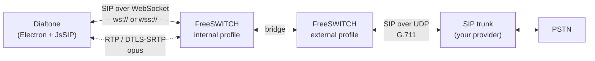

# Setting up Dialtone end to end

From nothing to a working desk phone: a FreeSWITCH server that speaks WebRTC,
and the app that registers to it.

Budget about 30 minutes the first time. Most of it is the server; the app is
four fields.

---

## How the pieces fit



Two things follow from this diagram, and they cause most of the trouble:

- **Dialtone cannot use plain SIP on port 5060.** Chromium speaks SIP over
  WebSocket and nothing else. That is why the server needs a `ws-binding`, and
  why "it works with my desk phone" tells you nothing about whether it will
  work here.
- **The last hop is WebRTC, the trunk hop is not.** FreeSWITCH transcodes
  between them. Anything that assumes one codec end to end will break.

---

## Prerequisites

| | |
|---|---|
| A Linux host for FreeSWITCH | A Raspberry Pi 5 is plenty for a few concurrent calls |
| Docker on that host | `curl -fsSL https://get.docker.com \| sh` |
| Node.js 20+ on the desktop | Only for installing and running the app |
| A network path between them | LAN, VPN, or a mesh like Tailscale/NordVPN Meshnet |
| A SIP trunk | Optional — internal calls and the test numbers work without one |

If the desktop and the server are on different networks, put them on a mesh
VPN. It removes NAT from the media path entirely, which is the single biggest
source of "the call connects but nobody can hear anything".

---

## Part 1 — the FreeSWITCH server

### 1.1 Get a FreeSWITCH image

If you already have one, skip this. Otherwise build from the Dockerfile in
this repo's sibling project, or any FreeSWITCH 1.10 image that includes
`mod_sofia` and `mod_opus`. Check with:

```bash
docker run --rm YOUR_IMAGE fs_cli -x "show codecs" | grep -iE "opus|G.711"
```

You need OPUS and at least one of G.711 ulaw/alaw. Without opus the browser
still connects, on G.711, at telephone quality.

### 1.2 Run the setup script

`freeswitch/pi/setup.sh` builds a complete, self-contained FreeSWITCH
configuration and starts it in a container. It is idempotent — re-run it any
time to reapply everything.

```bash
scp freeswitch/pi/setup.sh you@server:~/dialtone-fs-setup.sh
ssh you@server bash ~/dialtone-fs-setup.sh
```

Read the top of the script before running it. In particular the port table —
it deliberately avoids the defaults so it can coexist with another FreeSWITCH
on the same host:

| | default FreeSWITCH | this one |
|---|---|---|
| internal SIP | 5060 | **5062** |
| external SIP | 5080 | **5082** |
| ws / wss | 5066 / 7443 | **5068 / 7445** |
| event socket | 8021 | **8022** |
| RTP | 16384–32768 | **32769–40000** |

If you are *not* sharing the host, these are still fine — just remember them.

The script picks the address to bind the softphone side to from the `nordlynx`
interface. **Change `BIND_IP` if your setup differs** — it must be an address
the desktop can reach.

### 1.3 Set the extension password

```bash
sudo nano /home/alex/dialtone-fs/conf/vars/dialtone_vars.xml
```

Set `dialtone_password` to something long and random:

```bash
tr -dc 'A-Za-z0-9' </dev/urandom | head -c 24; echo
```

This password is the only thing between anything on your network and your
phone bill, once a trunk is attached. Do not reuse one.

Then:

```bash
sudo docker exec dialtone-freeswitch fs_cli -P 8022 -x reloadxml
```

> **`-P 8022` on every `fs_cli`, always.** With `--network host`, `fs_cli`
> defaults to 127.0.0.1:8021 — which is a *different* FreeSWITCH if one is
> running. Without the port you will read the wrong server's status and
> execute commands against it.

### 1.4 Attach a trunk (optional)

Fill in the `landline_*` values in the same file, set
`landline_register=true`, then:

```bash
sudo docker exec dialtone-freeswitch fs_cli -P 8022 -x reloadxml
sudo docker exec dialtone-freeswitch fs_cli -P 8022 -x "sofia profile external restart"
sleep 35
sudo docker exec dialtone-freeswitch fs_cli -P 8022 -x "sofia status gateway landline"
```

Wait the full 35 seconds. The first REGISTER after a profile restart commonly
fails and succeeds on the retry, so an immediate `FAIL_WAIT` means nothing.

`landline_did` should be your number in E.164. It becomes the gateway's
`Exten`, which is how the dialplan knows which line an inbound call arrived
on — some providers do not put the dialled number anywhere in the INVITE.

### 1.5 Verify the server before touching the app

```bash
FS="sudo docker exec dialtone-freeswitch fs_cli -P 8022"
$FS -x "sofia status"          # internal RUNNING on :5062, external on :5082
ss -lnt | grep 5068            # the WebSocket port is listening
```

If `internal` is missing from `sofia status`, read the container log — a bad
`wss.pem` takes the **whole profile** down, not just the TLS listener:

```bash
docker logs dialtone-freeswitch 2>&1 | grep -i "error creating sip ua"
```

---

## Part 2 — the app

### 2.1 Install — the easy way

Run **`Dialtone-Setup-<version>.exe`**. That is the whole of it: the Electron
runtime, the app and JsSIP are all inside the installer. **Nothing else needs
installing — no Node, no npm.**

It installs per-user, so there is no admin prompt, and it creates a Desktop
and Start Menu shortcut. Uninstalling leaves your contacts and call history in
`%APPDATA%\dialtone` alone; nothing is silently binned.

> **Windows will warn you on first run** — "Windows protected your PC". The
> installer is not code-signed, because a signing certificate costs money and
> is tied to a verified identity, which is hard to justify for something you
> install on your own machines. Click **More info → Run anyway**. If you would
> rather not take that on trust, build it yourself from source below; it is
> the same output.

### 2.2 Install — from source

For development, or to build the installer yourself:

```bash
git clone https://github.com/alexkotr1/dialtone
cd dialtone
npm install
npm start
```

`npm install` also downloads the Electron binary and bundles JsSIP into
`vendor/`. If the Electron download is skipped by a proxy or a cache:

```bash
node node_modules/electron/install.js
```

To produce the installer:

```bash
npm run dist        # -> dist/Dialtone-Setup-<version>.exe
npm run dist:dir    # unpacked, for testing without installing
```

First launch opens Settings, because there is nothing to dial with yet.

### 2.3 Connect

| Field | Value | Notes |
|---|---|---|
| WebSocket server | `ws://SERVER:5068` | `wss://SERVER:7445` for TLS |
| Extension | `1005` | |
| SIP domain | the server's IP | Must match what the server binds to |
| Password | from step 1.3 | |
| STUN | *empty* | Leave blank on a LAN or mesh — it only adds latency |

Press **Save & connect**. The dot in the bottom-left goes green.

`ws://` is not a compromise on a mesh VPN or a trusted LAN — the tunnel is
already encrypted, and it avoids certificates entirely. Use `wss://` across
anything you do not control. Self-signed certificates work: Dialtone shows
you the fingerprint and connects only if you accept it, so compare it against
the server first:

```bash
openssl x509 -noout -fingerprint -sha256 -in /home/alex/dialtone-fs/conf/tls/wss-cert.pem
```

### 2.4 Prove the audio works

Dial these before trusting anything. They cost nothing and never leave the
server:

| Dial | What it proves |
|---|---|
| **9197** | Milliwatt — a steady 1004 Hz tone. Proves you can *hear*. |
| **9196** | Echo — repeats what you say. Proves your *microphone* reaches the server. |
| 9198 | Tone stream |

9197 is the more useful of the two because it has a known answer. If what
comes back is not a clean steady tone, the audio path is wrong and you do not
need an opinion about how it sounded.

**If 9196 is silent, check the microphone before blaming the network.** A
wireless headset that is powered off opens successfully and returns digital
silence. Settings → Audio has a live level meter for exactly this — speak,
and the bar should move.

### 2.5 Desktop shortcut

The installer makes one. If you are running from source instead:

```powershell
npm run shortcut
```

Puts `Dialtone.lnk` on the Desktop with a proper icon. Add `-StartMenu` for
both, `-Remove` to take them away.

### 2.6 Run at startup

Settings → Behaviour:

- **Start with Windows** — launches at login straight into the tray, no
  window. Off by default.
- **Keep running in the tray when closed** — on by default, and worth leaving
  on: a softphone that quits when you close its window silently stops taking
  calls. Quit from the tray icon.
Settings → Audio also has separate volume sliders for the **ringtone** (the
incoming ring and the ringing tone on outgoing calls) and the **keypad tones**.
The ringtone plays a short preview when you release its slider, so you can set
it by ear rather than by guessing. Both default to the level these sounds
always had.

- **Show a call popup** — on by default. When a call arrives and Dialtone is
  not the window in front, a small card slides in at the bottom-right with the
  caller's name, Answer and Decline. Answering turns it into a live timer; it
  slides out when the call ends. It is shown without taking focus, so it does
  not interrupt what you were typing.

---

## Making and receiving calls

**Outbound.** Anything six digits or longer goes out through the trunk.
Shorter numbers stay internal, so `1005` and the `919x` test numbers keep
working.

**Inbound.** Calls arriving on the trunk are routed to extension 1005 by
`dialplan/public/00_dialtone_inbound.xml`. That file also pins the codecs
offered to the browser — see the troubleshooting table for why that one line
is not optional.

**Sharing a trunk with something else.** If another SIP client registers the
same account, most registrars keep both bindings and inbound calls ring in
both places, first to answer wins. Some clear the whole registration when one
side unregisters, briefly knocking the other off until it retries. Verify
with your provider rather than assuming; a second DID is the clean answer if
both need to work independently.

---

## Moving to another machine

Settings → Backup → **Export to a file**. Copy the file across, then
**Import from a file** on the new machine.

The password is **not** included by default. It is encrypted with a key tied
to the original user account and machine, so it cannot be carried over
encrypted — including it means it sits in the file as readable text. The
toggle is there if you want that trade; otherwise re-enter the password on
the new machine.

Import offers **Merge** (keeps what is there, adds what is new — contacts
matched by number, so re-importing your own export does nothing) or
**Replace**. Connection settings are replaced either way.

---

## Troubleshooting

Each of these cost real time to find. The symptom is almost never the cause.

| Symptom | Cause | Fix |
|---|---|---|
| "No response from ws://…" | Wrong port, firewall, or the profile never started | `sofia status` — is `internal` listed at all? |
| `internal` missing from `sofia status` | Bad or unreadable `wss.pem` — takes the **whole profile** down, not just TLS | Config tree must be writable by the container's uid (999); `certs_dir` is `etc/freeswitch/tls` |
| "Authentication failed" | Wrong password, or the user is in a different domain | `fs_cli -P 8022 -x "user_exists id 1005 YOUR_DOMAIN"` |
| Registers, but calls fail after **exactly 10 seconds** with "No common audio codec" | ICE candidate ACL. Default `wan.auto` denies `100.64.0.0/10`, which is where mesh VPNs live. The codec negotiated fine; the message is wrong | `apply-candidate-acl` with an ACL allowing your range. **Not** `candidate-acl` — mod_sofia ignores unknown params silently |
| Inbound calls fail with `INCOMPATIBLE_DESTINATION` | FreeSWITCH offered the browser whatever the inbound leg used — `L16` from a loopback, G.711 from a trunk. Chromium cannot do L16 | `export nolocal:absolute_codec_string=opus,PCMU,PCMA` before bridging |
| Inbound calls connect to 10 seconds of silence, then fail | FreeSWITCH's stock nag extension. It matches *every* destination while `default_password` is `1234`, logs four CRITs and sleeps | Change `default_password` in `vars.xml` |
| Call connects, timer runs, total silence | NAT on the media path | Set `ext-rtp-ip`/`ext-sip-ip`, or put both ends on a mesh |
| Echo test silent, tone test fine | The microphone, not the network | Settings → Audio, watch the level meter |
| `fs_cli` reports the wrong server | Missing `-P 8022` with `--network host` | Always pass it |

### Getting the truth out of FreeSWITCH

```bash
FS="sudo docker exec dialtone-freeswitch fs_cli -P 8022"
$FS -x "sofia global siptrace on"     # every SIP message, with SDP
$FS -x "console loglevel debug"       # codec and ICE decisions
docker logs -f dialtone-freeswitch
```

Debug level is where the useful lines are. `NO candidate ACL defined,
Defaulting to wan.auto` appears nowhere else, and it is the entire
explanation for a class of failure that presents as a codec error.

Turn it back down afterwards — debug is loud:

```bash
$FS -x "console loglevel notice"; $FS -x "sofia global siptrace off"
```

### Testing inbound without spending a call

```bash
sudo docker exec dialtone-freeswitch fs_cli -P 8022 \
  -x "originate loopback/YOUR_DID/public 9197 XML default"
```

Injects a call into the `public` context with your DID as the destination —
the same shape a real trunk call takes — and bridges it to milliwatt once the
softphone answers. The app should ring; answering should give you a tone.

---

## Tests

```bash
npm test          # 23 checks, inside the real app against the real DOM
npm run wss       # a TLS server with a fresh self-signed cert
npm run test:cert # drives the real trust dialog, then checks the socket opens
```

`npm test` needs no SIP server. It covers number matching, the store, the
import merge rules, the keypad, and every path that fires when something is
misconfigured — which is the code you actually meet on a bad day.
